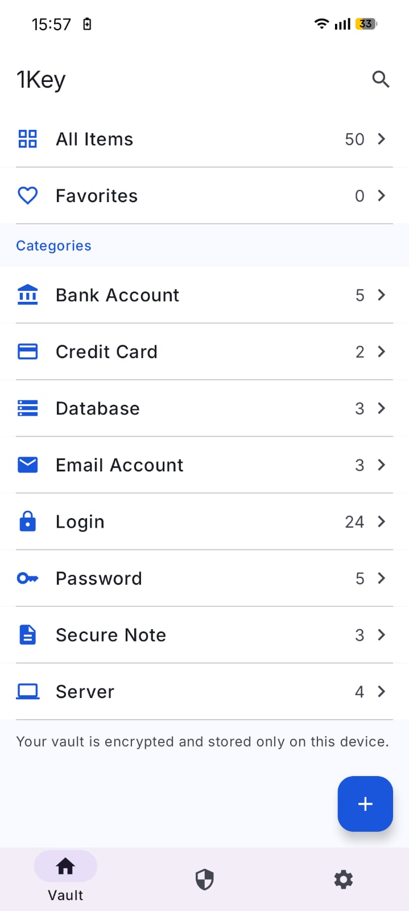
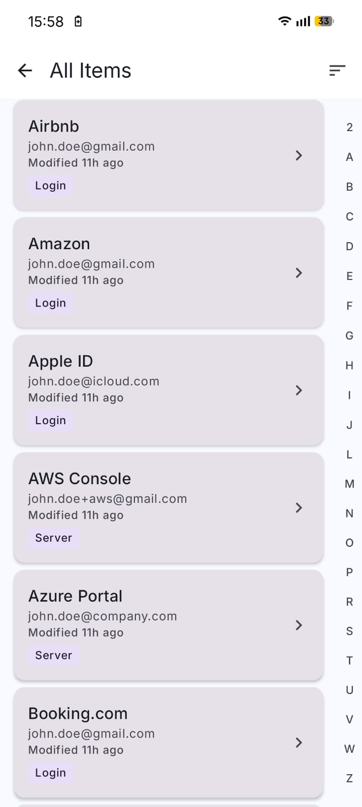
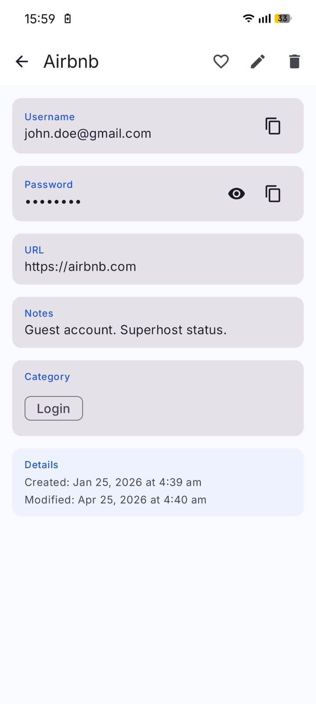
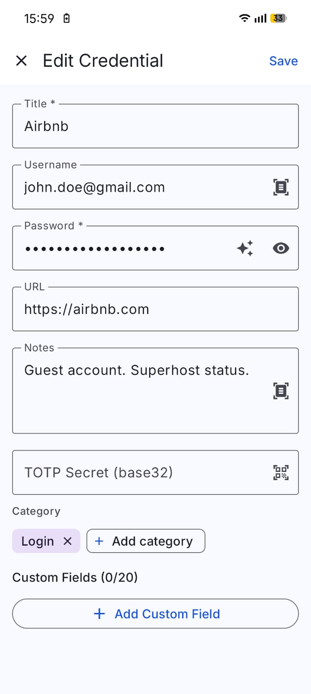
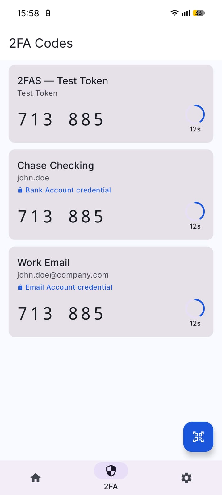
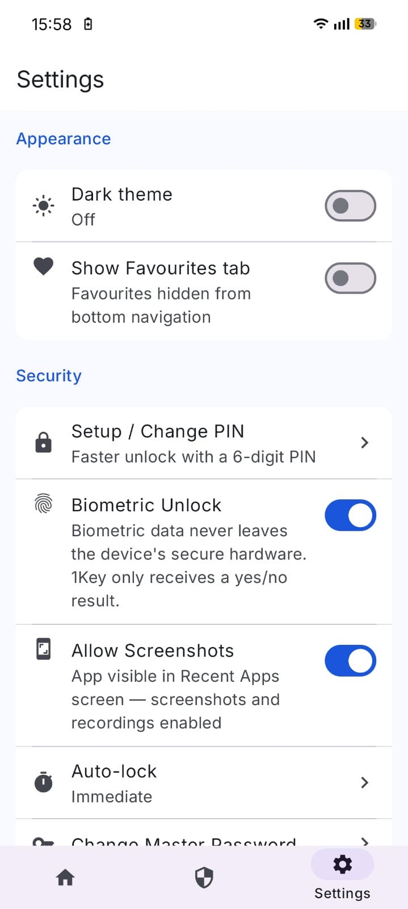

# 1Key — Local-First Password Manager for Android

> Built because I got tired of paying £35/year just to autofill a password.

Most password managers lock their best features behind a subscription — cross-device sync, secure notes, TOTP codes, and even basic export often require a premium plan. 1Key exists to give you all of that, for free, forever, with no account required and no server ever involved.

---

## Screenshots

<table>
  <tr>
    <td align="center"><b>Vault Home</b></td>
    <td align="center"><b>All Items</b></td>
    <td align="center"><b>Credential Detail</b></td>
  </tr>
  <tr>
    <td></td>
    <td></td>
    <td></td>
  </tr>
  <tr>
    <td align="center"><b>Edit Credential</b></td>
    <td align="center"><b>2FA / TOTP Codes</b></td>
    <td align="center"><b>Settings</b></td>
  </tr>
  <tr>
    <td></td>
    <td></td>
    <td></td>
  </tr>
</table>

---

## Why 1Key?

Every major password manager today requires you to:

- **Create an account** — your vault identity lives on someone else's server
- **Trust their encryption** — you have no way to verify how they actually store your data
- **Pay for the features that matter** — TOTP codes, secure export, and device sync are almost always premium
- **Accept telemetry** — usage analytics, crash reporting, and "improvement data" collection are on by default

1Key takes a different position: your passwords are yours. They live on your device, encrypted by a key only you hold, and they never move unless you explicitly export them.

---

## Privacy

1Key collects **nothing**. No analytics, no crash reporting, no telemetry, no usage data — not even anonymised. There is no backend, no account system, and no network permission in the manifest.

- All data is stored locally in an encrypted Room database
- The master password never leaves the device — not even a hash is transmitted
- Screenshots and Recent Apps previews are blocked by default via `FLAG_SECURE`
- The app requests the minimum possible permissions

The only things that leave your device are files you explicitly choose to export.

---

## Encryption

Security is not a checkbox here. 1Key uses two independent layers of protection:

### AES-256-GCM — data at rest
Every credential stored on disk is encrypted with AES-256-GCM. This is the same cipher used by Signal, WhatsApp, and most modern TLS connections. The authenticated encryption tag means any tampering with the ciphertext is detected before decryption.

### Android Keystore — biometric key wrapping
When biometric unlock is enabled, a hardware-backed key is generated inside the device's Trusted Execution Environment (TEE) or StrongBox secure enclave. This key never leaves the secure hardware — it is used to wrap and unwrap the vault key. The operating system enforces that it can only be used after a successful biometric challenge. 1Key only receives a yes/no result from the biometric prompt; the fingerprint or face data never enters app memory.

### Encrypted backups
Backup files (`.1key`) are encrypted with AES-256-GCM before being written to disk or shared. The backup key is derived from your master password using a KDF with a random salt stored in the file header. Without the original password, the file is indistinguishable from random bytes.

---

## Features

### Password Vault
- Store credentials with title, username, password, URL, notes, and custom fields
- Tag-based organisation with custom categories
- Favourites tab for frequently used accounts
- Full-text search across all fields

### TOTP / 2FA — all in one place
Most apps make you switch between a password manager and a separate authenticator. 1Key stores both in the same credential entry. Scan a QR code once, and your TOTP codes live alongside the password they protect — no app switching.

- Scan setup QR codes with the built-in camera scanner
- Live 30-second countdown with automatic code refresh
- One-tap copy to clipboard

### OCR Credential Capture
Point your camera at a printed password, a screen showing credentials, or a physical token card, and 1Key extracts the text using on-device ML Kit OCR — no image is uploaded. The recognised text is pre-filled into the credential form for you to review and save. Everything runs locally on the device.

### Backup & Import
- Export your vault as an encrypted `.1key` file (AES-256-GCM) or plain CSV/JSON
- Encrypted exports require your master password to restore — no password, no access
- Import from 1Key backups or directly from other password managers

**Supported import sources:**
| App | Format |
|-----|--------|
| Google Passwords | CSV |
| LastPass | CSV |
| KeePass | CSV |
| Safari / iCloud Keychain | CSV |
| 1Password | CSV |
| Dashlane | CSV |
| NordPass | CSV |

The importer auto-detects format and column headers — no manual mapping required. Duplicate credentials are detected and skipped.

### Unlock Options
- **Master password** — always available as the primary fallback
- **Biometric** — fingerprint or face unlock backed by hardware-secure key; requires master password confirmation to enable
- **PIN** — 6-digit PIN for quick access; resets to master password if removed
- **Auto-lock** — configurable idle timeout (immediate, 1 min, 5 min, 15 min, 1 hour, never)
- **Periodic recheck** — optionally require master password every N hours even when biometric/PIN is in use
- **Attempt limiting** — 3 failed attempts on biometric enable or encrypted export locks the vault

---

## Tech Stack

| Layer | Technology |
|-------|-----------|
| Language | Kotlin |
| UI | Jetpack Compose + Material 3 |
| Architecture | MVVM + Clean Architecture |
| DI | Hilt / Dagger |
| Database | Room (SQLite) |
| Encryption | AES-256-GCM via Android `CipherOutputStream` |
| Biometric | AndroidX Biometric + Android Keystore |
| OCR | ML Kit Text Recognition (on-device) |
| QR Scanning | ML Kit Barcode Scanning (on-device) |
| Async | Kotlin Coroutines + StateFlow |
| Navigation | Jetpack Navigation Compose |

---

## Building

```bash
git clone https://github.com/roufsyed/1key.git
cd 1key
./gradlew assembleDebug
```

Requires Android Studio Hedgehog or later. No API keys, no `.env` files, no setup — clone and build.

---

## Permissions

| Permission | Reason |
|-----------|--------|
| `CAMERA` | QR code scanning and OCR credential capture |
| `USE_BIOMETRIC` | Biometric unlock |
| `USE_FINGERPRINT` | Biometric unlock (legacy API) |

No `INTERNET`. No `READ_CONTACTS`. No `ACCESS_FINE_LOCATION`. Nothing else.

---

## License

MIT
