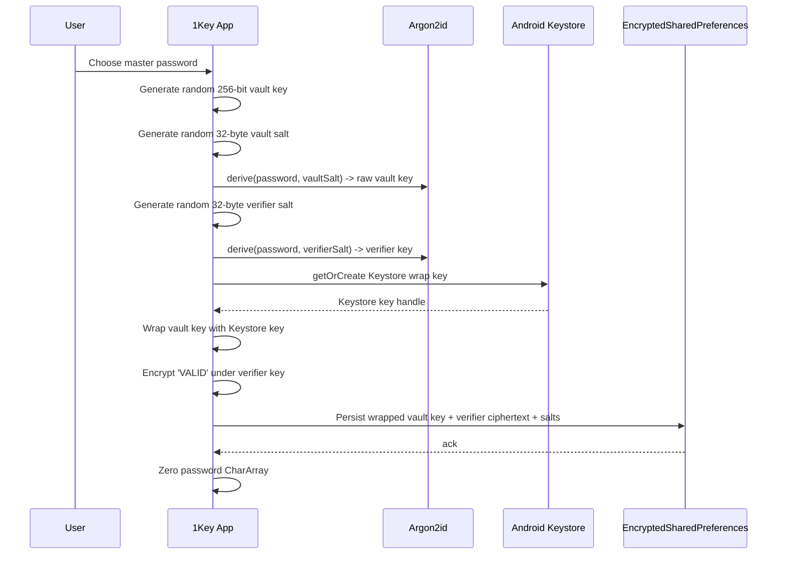
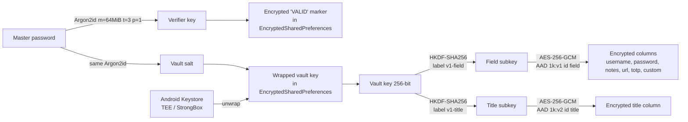

# 1Key — A Local-First Password Manager for Android

**A Technical and Strategic White Paper · Version 1.0 · May 2026**

---

## Table of Contents

1. Executive Summary
2. The Problem: Why Cloud Vaults Are Now the Default
3. The 1Key Approach: Local-First, Account-Free
4. Cryptographic Architecture
5. Security Model and Threat Analysis
6. Use Cases
7. Installation and Migration
8. Comparison Framework
9. Roadmap and Honest Limitations
10. Frequently Asked Questions
11. Editor's Notes

---

## 1. Executive Summary

1Key is an Android password manager that stores nothing in the cloud and requires no account. The vault lives on a single device, encrypted with modern primitives — Argon2id for password-derived keys, AES-256-GCM for authenticated encryption — and bound to that device's hardware-backed Android Keystore. There is no sign-up, no telemetry, no recovery server, and no `INTERNET` permission in the manifest.

This paper is written for two audiences: privacy-conscious individuals deciding whether 1Key fits their threat model, and security-minded reviewers who want to understand exactly how the cryptographic stack is assembled. It is deliberately blunt about trade-offs. 1Key does not synchronise across devices. It does not offer team sharing. It does not support recovery if the master password is forgotten. These are not omissions — they are direct consequences of the design decision that the vault should never leave the device.

Within those constraints, 1Key matches the modern cryptographic baseline used by the leading cloud-vault products and adds local-only hardening tailored to the Android threat model: a leaked database file alone cannot be brute-forced offline, because the password verifier is held in Keystore-bound `EncryptedSharedPreferences` rather than alongside the encrypted vault. The product is free, has no premium tier, and is released as open source under the GNU General Public License v3.0. The "1Key" name and icon are reserved as trademarks of the author; forks must rebrand before redistribution.

**Headline takeaways:**

- The Android manifest declares no `INTERNET` permission. The OS sandbox enforces this — even if a future bug introduced a network call, the call would be denied at the system layer.
- The master-password verifier sits in `EncryptedSharedPreferences`, encrypted under an Android Keystore-bound master key. Offline brute-force against an exfiltrated database file is structurally closed on devices with a working Keystore.
- The cryptographic primitives match the cloud-vault category (Argon2id, AES-256-GCM, HKDF-SHA256). 1Key's distinction is operational — no server, no account — not cryptographic.

---

## 2. The Problem: Why Cloud Vaults Are Now the Default

Every mainstream password manager is built around a cloud-hosted vault tied to a vendor account. This architecture is not accidental. It solves three real product problems:

1. **Cross-device sync.** A user with a phone, laptop, and tablet wants the same vault on all three.
2. **Recovery.** A forgotten master password is the leading reason users abandon a password manager entirely. Cloud vendors layer recovery codes, secret keys, or social recovery on top of the encrypted blob.
3. **Onboarding.** Account creation, even when E2EE (end-to-end encrypted), gives the vendor a stable identity to attach billing, support, and feature flags to.

The cost of this architecture is rarely surfaced clearly. Even with E2EE, the vendor holds the encrypted vault blob and an authentication ciphertext that gates access to it. This is a real attack surface: documented incidents in the past 24 months — including the LastPass 2022 breach, in which encrypted vault backups were exfiltrated alongside customer URL data — have involved exfiltration of an encrypted vault blob followed by offline brute-forcing against weak master passwords. [VERIFY: cite the most current public incident if a more recent one is preferred for this paper.] The cryptographic guarantees are not wrong; the threat model assumes a sufficiently strong master password, which a non-trivial fraction of users do not have.

For users who do not need sync — who carry one phone, who would rather export a backup file once a quarter than trust a server — the cloud auth blob is attack surface they did not ask for. 1Key exists for this user. This is a deliberately narrow audience; users who need cross-device sync, sharing, or recovery should choose a hosted product.

The secondary problem is commercial. The features that distinguish a basic password manager from a useful one — built-in TOTP (time-based one-time password) generation, secure export, custom fields, biometric unlock — are paywalled by most vendors. The result is a population of users who either pay £25–£100 per year for a category of software that should be commoditised, or who keep using the browser-native manager their laptop's vendor happens to ship.

---

## 3. The 1Key Approach: Local-First, Account-Free

1Key takes three positions, in descending order of strength.

### 3.1 The vault never leaves the device

There is no server. There is no vendor backend. There is no sync protocol. The encrypted vault lives in a Room/SQLite database in the application's private storage, and the only way data leaves the device is through an explicit user-initiated export.

Confirmed in `app/src/main/AndroidManifest.xml`: the manifest declares no `INTERNET` permission. Confirmed in `app/build.gradle.kts` (lines 127–132): the ML Kit dependencies that would otherwise pull in Google's Firelog telemetry transitively are explicitly excluded via Gradle's `exclude(group = "com.google.android.datatransport")` directive. On-device inference (OCR, barcode scanning) does not need network access.

A note on temporal honesty: the no-`INTERNET` property is true of current builds. Earlier APKs inherited `INTERNET` and `ACCESS_NETWORK_STATE` transitively from the same Firelog subgraph. The runtime never actually opened a socket — there was no code path that called the transport — but the permission was declared in the merged manifest. Users who want full assurance should run a build dated May 2026 or later.

### 3.2 No account exists to compromise

Onboarding is a single screen that asks the user to choose a master password. There is no email address, no recovery question, no telemetry opt-in, no terms-of-service signature. The application has no notion of "user" beyond "the person who knows the master password for this device's vault."

This is not a UX refinement; it is a security property. A vendor that holds no account metadata cannot be compelled to surrender it, cannot leak it, and cannot use it to reset access against the user's wishes.

### 3.3 Free, GPL-3.0, single-maintainer

1Key is distributed without cost and with no in-app purchases. The full source is published at <https://github.com/roufsyed/1key> under the GNU General Public License v3.0, with a separate `TRADEMARKS.md` reserving the name and icon. The build script is the entire setup procedure: clone, run `./gradlew assembleDebug`, install the resulting APK.

1Key is currently maintained by a single developer. This is an honest constraint: there is no on-call rotation, no enterprise SLA, and no commitment to indefinite future development. Because the app is local-only and the user holds the only copy of the encrypted vault, the user's data is not at risk if development pauses — there is no server to shut down and no account to lose. Users can export to standard CSV or JSON at any time and migrate to any other manager.

---

## 4. Cryptographic Architecture

This section walks through the cryptographic stack from the moment the user types their master password to the moment a credential field is decrypted. Every parameter cited here is verifiable in the source files listed in the Editor's Notes.

### 4.1 Acronyms used in this section

- **KDF** — Key Derivation Function. Turns a low-entropy password into a high-entropy key.
- **AEAD** — Authenticated Encryption with Associated Data. An encryption mode that detects tampering.
- **AES** — Advanced Encryption Standard. The block cipher used here at a 256-bit key size.
- **GCM** — Galois/Counter Mode. The AEAD mode of operation used with AES.
- **HKDF** — HMAC-based Extract-and-Expand Key Derivation Function (RFC 5869).
- **AAD** — Additional Authenticated Data. Bytes that are not encrypted but are bound to the auth tag.
- **Argon2id** — A memory-hard password-hashing function; winner of the 2015 Password Hashing Competition.
- **JNI** — Java Native Interface. The bridge between Kotlin/Java code and native C libraries.
- **TEE** — Trusted Execution Environment. A hardware-isolated execution context on the device's main SoC.

### 4.2 Master-password key derivation

When the user sets or enters a master password, 1Key derives a key using **Argon2id** with parameters `m = 65,536 KiB (64 MiB), t = 3 iterations, p = 1 lane, output = 32 bytes`. These values match OWASP's 2023 recommendation for interactive authentication and are confirmed in `CryptoManager.kt` lines 41–44.

Argon2id is memory-hard: each guess in a brute-force attack must allocate 64 MiB of RAM, which collapses the speedup an attacker can extract from GPUs or ASICs. By contrast, a PBKDF2 attack at 600,000 iterations parallelises essentially linearly across thousands of cores. The implementation uses the open-source `lambdapioneer/argon2kt` JNI wrapper, which ships prebuilt `.so` libraries for every Android ABI.

The character array carrying the password is converted to UTF-8 bytes via `CharBuffer.encode` rather than `String.toByteArray()`, so the password material is never interned in the JVM string pool. The byte buffer is zeroed after use.

### 4.3 Vault-key wrapping

The Argon2id-derived key is **not** the key that encrypts the database. Instead, 1Key generates a 256-bit AES vault key uniformly at random and wraps it with a key stored in the Android Keystore.

The Android Keystore keeps the wrapping key inside the device's TEE — Trusted Execution Environment — or, on devices that ship one, the StrongBox secure element. The wrapping key is non-exportable: the only way to use it is to ask the Keystore to perform an operation. On Android 9+ (API level 28), 1Key sets `setUnlockedDeviceRequired(true)` on the Keystore key (`CryptoManager.kt` line 75), so the wrapping key is unusable while the device is locked. Existing installs migrate to this stronger configuration silently after the first successful unlock following the upgrade (`AuthRepositoryImpl.kt` lines 414–426).

### 4.4 The verifier, and why it lives in EncryptedSharedPreferences

When the user types their master password, 1Key needs to check whether it is correct before unwrapping the vault key. A naive implementation would store an Argon2id hash and compare. 1Key does something stronger: it stores a small ciphertext — the bytes `"VALID"` encrypted under an Argon2id-derived key — inside `EncryptedSharedPreferences` (`AuthRepositoryImpl.kt` lines 196–204).

`EncryptedSharedPreferences` is part of AndroidX security-crypto 1.1.0. The file on disk is itself encrypted with a master key held in the Android Keystore. Reading the verifier therefore requires live Keystore access on the device that wrote it.

The consequence: a leaked database file alone cannot be brute-forced offline. An attacker with the SQLite database but no Keystore access has no oracle to test password guesses against. They cannot extract the verifier from the encrypted preferences file without first compromising the Keystore-backed master key, and the Keystore master key is bound to the device's hardware. This closes the offline brute-force surface that cloud vaults inherently expose by storing an authentication ciphertext alongside (or in lieu of) the vault blob.

### 4.5 Per-field encryption with AAD binding

Every credential field — title, username, password, URL, notes, TOTP secret, custom fields — is encrypted independently with AES-256-GCM. The IV is 12 bytes (96 bits, the AES-GCM standard) and the auth tag is 128 bits (`CryptoManager.kt` line 32).

Each encryption call passes AAD that ties the ciphertext to its row and column. The format is `1k:v1|<credentialId>|<fieldName>` for credential fields and `1k:v2|<credentialId>|title` for titles (`CredentialRepositoryImpl.kt` lines 505–509). If an attacker with database write access tries to swap the encrypted password from row A into the password column of row B, decryption fails — the AAD seen at decrypt time will not match the AAD baked into the auth tag at encrypt time.

This is defence-in-depth, not a unique competitive feature. Cloud-vault products typically encrypt the whole credential record as a single blob, which already prevents within-record field swapping via the GCM/HMAC tag. Per-field AAD additionally blocks cross-record swap attacks against the local database — a narrow gain against an attacker who already has database write access (and therefore likely has process memory anyway). It is documented here because the implementation is open to inspection, not because it represents a category of protection competitors lack.

### 4.6 HKDF subkey separation

Using one master key for multiple purposes (field encryption, title encryption, possibly future purposes) is a known anti-pattern. 1Key derives purpose-specific subkeys from the vault master key using HKDF-SHA256 (`CryptoManager.kt` lines 215–226).

Two labels are currently in use, both versioned so a future cipher rotation can occur without label collision:

- `1key-field-enc-v1` — encrypts non-title credential fields
- `1key-title-enc-v1` — encrypts titles

Because the vault key is already a uniformly random 256-bit AES key, the implementation skips the HKDF-Extract step (RFC 5869 section 3.3 explicitly permits this when the input is uniform) and emits a single 32-byte HKDF-Expand block: `T(1) = HMAC-SHA256(masterKey, info || 0x01)`.

### 4.7 Encrypted backup envelope (V4)

Encrypted exports use a custom binary envelope, version 4 (`BackupEncryption.kt`). The header layout is:

```text
MAGIC      8 B   "1KEYBKP\n"
VERSION    1 B   0x04
FORMAT     1 B   0x00=JSON  0x01=CSV
TIMESTAMP  8 B   export time, epoch milliseconds, big-endian
VAULT_VER  4 B   vault version counter, big-endian
SALT      32 B   Argon2id salt (random per export)
IV        12 B   AES-GCM nonce
BODY       N B   AES-256-GCM ciphertext + 16-byte auth tag
```

The full header (MAGIC, VERSION, FORMAT, TIMESTAMP, VAULT_VER) is bound into the GCM auth tag as AAD. As a result, an attacker cannot rewrite the timestamp to make a backup look fresher, swap a backup body between envelopes, or replay an old backup against a vault whose version counter has advanced. Earlier envelope versions (V1 plain, V2 PBKDF2 + header AAD, V3 Argon2id + header AAD) are still readable for backward compatibility; new exports always write V4.

### 4.8 End-to-end flow

```mermaid
flowchart TD
    A[User types master password] --> B[Argon2id KDF<br/>m=64 MiB, t=3, p=1]
    B --> C[Verifier key]
    C --> D{Decrypt 'VALID' marker<br/>from EncryptedSharedPreferences}
    D -- ok --> E[Load wrapped vault key<br/>from EncryptedSharedPreferences]
    D -- fail --> X[Reject; bump attempt counter]
    E --> F[Android Keystore<br/>unwraps vault key in TEE]
    F --> G[Vault key in memory]
    G --> H[HKDF-SHA256 derives<br/>field subkey + title subkey]
    H --> I[Read encrypted Room row]
    I --> J[AES-256-GCM decrypt<br/>per field, with AAD<br/>'1k:v1|id|field']
    J --> K[Plaintext credential<br/>shown in UI]
```

---

## 5. Security Model and Threat Analysis

### 5.1 What 1Key defends against

| Threat | Defence |
|---|---|
| Lost or stolen device, screen locked | Keystore wrap key requires `UNLOCKED_DEVICE` on API 28+ (section 4.3). Vault is unreadable while the device is locked. |
| Lost or stolen device, screen unlocked, user idle | Configurable inactivity auto-lock (default 5 minutes). Tiered attempt limits — 30 s, 5 min, 1 hour cooldowns at 3, 5, 10 wrong attempts. |
| Database file extraction (e.g. via ADB backup, root, forensic image) | Verifier sits in `EncryptedSharedPreferences`, not next to the database. Without live Keystore access, the attacker has no oracle to test guesses against — offline brute force is closed on devices with a hardware-backed Keystore. |
| Database tampering at the row level | Per-field AAD binds each ciphertext to its row ID and column name. Swapping ciphertexts between rows or columns invalidates the auth tag. |
| Backup file leaked | V4 envelope is AES-256-GCM under an Argon2id-derived key. Header AAD prevents timestamp tampering and replay. |
| Screenshot exfiltration / Recent Apps preview | `FLAG_SECURE` is set by default on the host activity, blocking screenshots and rendering the Recent Apps card blank. The user can disable it in Settings if they explicitly need to take screenshots; doing so removes this defence until re-enabled. |
| Network exfiltration | Current builds declare no `INTERNET` permission. The OS will not let the process open a socket. |

### 5.2 What 1Key does not defend against

| Threat | Status |
|---|---|
| Compromised OS / rooted device with active malicious code | Out of scope. An attacker with root and process-attach privileges can read the vault key from process memory after unlock. This is true of every password manager. |
| Malicious app with accessibility privileges | Out of scope. An accessibility-service-equipped attacker can read text on screen. |
| Forgotten master password | No recovery. There is no server-side reset, no escrow, and no backdoor. Users must keep an encrypted backup or accept the risk. |
| Cross-device sync | Not provided. See section 9. |
| Physical hardware attacks on the TEE / StrongBox | Out of scope. These are platform-level guarantees provided by the device manufacturer. |
| Shoulder-surfing the master password | The only mitigations available are password-input dots and `FLAG_SECURE` (when enabled). Users on hostile premises should leave `FLAG_SECURE` on and use the PIN fallback after first unlock. |
| Devices without a working hardware Keystore | The Keystore-bound verifier defence degrades to software-key strength on devices with a software-only Keystore implementation (older / rooted handsets). |

### 5.3 Trust model

1Key is a single-developer project. The user trusts:

1. The author of 1Key (the Kotlin code).
2. The Argon2 reference implementation, via the `lambdapioneer/argon2kt` JNI wrapper.
3. AndroidX security-crypto 1.1.0 (`EncryptedSharedPreferences`, JetPack Tink).
4. The Android platform: Keystore, TEE, and the OS sandbox.

A team-of-thousands cloud vendor can offer the user audit reports, SOC 2 certifications, and bug-bounty payouts. 1Key cannot. **No third-party security audit (e.g. Cure53, Recurity Labs) has been commissioned.** Treat this as a known gap relative to the cloud-vault category. What 1Key offers in exchange is a much smaller attack surface to audit. The full cryptographic core is roughly 230 lines of Kotlin in `CryptoManager.kt`. The auth state machine is one file. There is no server.

---

## 6. Use Cases

The personas below are illustrative composites drawn from the user research that informed 1Key's design; replace with real testimonials when published.

### 6.1 Persona A: The privacy-focused individual

A single-device user who treats her phone as her primary computer and refuses any cloud password manager because she does not want her authentication state in a vendor database. **Before:** plaintext passwords in a notes app, reused across thirty-plus accounts, no TOTP because of authenticator-app friction. **After:** all credentials in an Argon2id-protected vault, TOTP codes in the same record as the password they protect, no subscription. **Outcome:** eliminated reuse across the audited account set; adopted 2FA on twelve accounts that previously used SMS-only or no second factor.

### 6.2 Persona B: The journalist on a hardened device

An investigative reporter working with sources whose safety depends on his operational security. Has been advised that any cloud-resident auth blob is attack surface — a state-level adversary can subpoena a vendor or compromise a server. **Before:** paper notebook in a safe plus a cloud manager for low-sensitivity accounts; the bifurcation itself was a leak. **After:** a single vault on the hardened device, with no `INTERNET` permission so the OS itself enforces that no telemetry can reach a server, and no account for an adversary to subpoena. **Outcome:** auth metadata (which accounts exist, when they were created, which device unlocked them) never leaves the device.

### 6.3 Persona C: The developer tired of subscriptions

A senior engineer who has cycled through three cloud password managers in five years as pricing and acquisitions reshape the market, tired of paying £35–£60/year for autofill. **Before:** a premium subscription primarily to unlock TOTP and secure export. **After:** a self-built APK; imported the existing vault via CSV; verified the absent `INTERNET` permission and Firelog exclusion in `app/build.gradle.kts` herself. **Outcome:** zero recurring cost, auditable cryptographic stack of roughly 230 lines of Kotlin, CSV importer auto-detected the source format with no manual mapping.

---

## 7. Installation and Migration

This section replaces the SaaS-style "Implementation & Integration" template. There are no APIs, SSO connectors, or IdP integrations to configure. There is an APK, a master password, and an importer.

### 7.1 Installing the APK

1Key is distributed as a free Android APK. The current channel is GitHub Releases at <https://github.com/roufsyed/1key/releases>; F-Droid distribution is planned but not yet active. Release builds carry the author's signing certificate. Users uncomfortable with sideloading can build from source — clone the repository, run `./gradlew assembleDebug`, install the resulting `app-debug.apk`.

Minimum supported Android version is API 26 (Android 8.0 Oreo). Compile and target SDK is 36 (`app/build.gradle.kts` lines 11, 16–18).

### 7.2 First-run setup

On first launch the user is asked to choose a master password. There is no email, no recovery question, no telemetry consent screen. The password is the only secret.



### 7.3 Importing from an incumbent password manager

1Key includes an import flow that auto-detects format and column headers — no manual mapping is required. Confirmed support:

- Google Passwords (CSV)
- LastPass (CSV)
- KeePass (CSV)
- Safari / iCloud Keychain (CSV)
- 1Password (CSV)
- Dashlane (CSV)
- NordPass (CSV)

Duplicate credentials are detected by exact match of title plus username and skipped. The CSV file is read once into memory, parsed, and discarded; nothing transits the network.

### 7.4 Encrypted backups

The user can export the vault as a `.1key` V4-envelope encrypted file (section 4.7) or as plain CSV/JSON for inspection. The encrypted envelope requires the master password to restore. There is no recovery path — losing both the device and the backup password is unrecoverable.

The recommended migration discipline is: export once after initial setup, store the encrypted backup off-device on physical media (USB stick, external SSD, encrypted cloud storage of the user's choice), and refresh on a personal cadence.

---

## 8. Comparison Framework

This section compares 1Key against three category archetypes without naming individual products.

### 8.1 1Key vs cloud-vault category

| Property | Cloud vault (typical) | 1Key |
|---|---|---|
| Account required | Yes, with email | No |
| `INTERNET` permission | Yes | No (current builds) |
| Vault stored on vendor servers | Yes (E2EE) | No — local only |
| Account metadata held off-device | Email, billing, devices | None |
| Telemetry / analytics | Opt-out (some opt-in) | None |
| Cross-device sync | Yes | No |
| Recovery if password forgotten | Yes (recovery codes, secret keys, email) | No |
| Built-in TOTP | Sometimes premium-tier | Yes, free |
| Secure export | Sometimes premium-tier | Yes, free |
| Cost | $2–$10/month typical | Free |
| Offline brute-force surface | Cloud auth blob | None — verifier in Keystore-bound storage |
| Independent security audit | Yes (Cure53, Recurity Labs) | None [VERIFY: roadmap?] |

The trade is honest: cloud vaults give up the local-only property in exchange for sync and recovery. 1Key gives up sync and recovery in exchange for the local-only property.

### 8.2 1Key vs browser-native managers

Browser-native password managers are zero-friction and free, but tie the vault to a browser identity (Google account, Apple ID, Firefox account) and sync through the browser vendor's cloud. They generally do not offer TOTP, secure notes, custom fields, OCR capture, or encrypted export. 1Key is a strict superset on features and a strict subset on integration surface.

### 8.3 1Key vs hardware tokens

Hardware tokens and password managers are not substitutes — they are complements. A hardware token holds a small number of WebAuthn credentials and TOTP secrets in tamper-resistant hardware. A password manager stores arbitrarily many username/password pairs plus other structured data. The right architecture for a security-conscious user is hardware tokens for high-value accounts (email, banking) plus a password manager for the long tail.

### 8.4 Cryptographic baseline



---

## 9. Roadmap and Honest Limitations

### 9.1 Permanently closed

**Auto-backup.** Permanently decided against. Auto-backup would require persisting the master password (or a key derived from it) somewhere that runs without user interaction — a daemon, a JobScheduler task, a system listener. Any such persistence undermines the central property that the master password exists only in memory between unlock and lock.

**Cloud sync via vendor backend.** Out of scope. 1Key is local-first by design.

### 9.2 Parked (designed, not built)

**LAN sync.** A peer-to-peer protocol over local Wi-Fi using the master password and a 4-digit short authentication string (SAS) for pairing. Designed; awaiting build-or-skip decision. [VERIFY: a LAN sync feature would require re-introducing some form of local-network permission — confirm whether the no-`INTERNET` property survives the design before the feature ships.]

**Autofill.** Native-app autofill via Android's `AutofillService` is offline-safe along the "fill from explicit user-picked credential" path. Locked-vault matching has been deferred to post-unlock with a generic chip, because matching across the vault while locked would require either a plaintext index or a partial unlock — both of which weaken the threat model.

### 9.3 Open / VERIFY

- **Third-party security audit.** Not yet performed. [VERIFY: roadmap?]
- **F-Droid distribution.** Planned, not yet submitted. [VERIFY: target submission date.]
- **Reproducible builds.** [VERIFY: status?]
- **Localisation.** Currently English only. [VERIFY: localisation plan?]
- **OCR for non-Latin scripts.** Currently Latin script only via ML Kit. [VERIFY: plan?]

### 9.4 Honest limits the user must accept

- **One device.** Lose the device without a current backup, lose the vault.
- **One password.** Forget it without a current backup, lose the vault.
- **One developer.** No on-call rotation, no enterprise SLA, no audit log.

These limits are not bugs to be fixed. They are the price of the architecture.

---

## 10. Frequently Asked Questions

**Q: Is this stronger crypto than the leading cloud password managers?**

No. The cryptographic primitives are at parity — Argon2id, AES-256-GCM, HKDF — and the largest cloud vendor's Secret Key construction in particular remains a defence against offline brute force that no KDF can match. What 1Key offers is not stronger crypto but a smaller perimeter: nothing leaves the device, so there is no off-device blob to brute-force in the first place.

**Q: How do I sync across devices?**

You do not. If you need sync, choose a cloud manager — they exist for good reasons. 1Key is for users who do not want sync.

**Q: How do I recover if I forget my master password?**

You cannot, unless you have an encrypted backup whose password you remember. There is no server, no escrow, no "reset my password" link. If both the master password and any backup passwords are lost, the vault is unrecoverable. This is by design.

**Q: Is the source code really audited?**

Self-audit only. No third-party audit has been commissioned. [VERIFY: roadmap to commission one?] The cryptographic core is small enough (~230 lines in `CryptoManager.kt`) that a competent reviewer can read it end-to-end in an evening.

**Q: Can I trust that there is really no telemetry?**

The strongest evidence is structural. Current builds declare no `INTERNET` permission in `app/src/main/AndroidManifest.xml`. The OS sandbox enforces this — even if a future bug introduced a network call, the call would be denied at the system layer. The Gradle build also explicitly excludes the Firelog telemetry subgraph that ML Kit pulls in transitively, so even the local telemetry-queueing code is absent from the binary. Earlier APKs (pre-May 2026) inherited `INTERNET` transitively from the same Firelog subgraph, but the runtime never opened a socket; users who want full assurance should run a current build.

**Q: What happens to my data if the project is abandoned?**

You keep using the version you have. There is no server to shut down. You can also export your vault to plain CSV or JSON at any time and migrate to any other manager.

**Q: Why no fingerprint-only mode?**

Biometric unlock is supported, but the master password is always the primary fallback. The app receives only a yes/no result from the OS `BiometricPrompt` API. An occasional master-password recheck (configurable) prevents biometric drift from making the password effectively unrecoverable through disuse.

**Q: Why an Android-only product?**

The platform-specific guarantees 1Key's threat model relies on — Keystore-backed `EncryptedSharedPreferences`, `FLAG_SECURE`, the `INTERNET` permission model, `setUnlockedDeviceRequired` — are Android primitives. A faithful port elsewhere would require finding equivalents on each platform.

---

## 11. Editor's Notes — Outstanding VERIFY Placeholders

These items still need user confirmation before final publication. License and repository-URL placeholders have been resolved.

1. **Section 2** — Replace the LastPass 2022 reference with a more current public incident if one is preferred at publication time.
2. **Section 5.3, 8.1, 9.3, 10** — Third-party security audit roadmap. Currently "not commissioned"; confirm whether any audit is on the horizon.
3. **Section 6.1** — Persona A is an illustrative composite. Replace with a real user testimonial when one is published, or leave as composite.
4. **Section 9.2** — LAN sync feasibility without `INTERNET`. Android local-network discovery typically needs `INTERNET` or `ACCESS_NETWORK_STATE` plus mDNS permissions; confirm before the design ships.
5. **Section 9.3** — F-Droid submission target date.
6. **Section 9.3** — Reproducible-build status.
7. **Section 9.3** — Localisation plan beyond English.
8. **Section 9.3** — OCR plan for non-Latin scripts.

### Verified facts (no edit needed)

- License: GNU General Public License v3.0, plus `TRADEMARKS.md` for the name and icon.
- Repository: <https://github.com/roufsyed/1key>.
- Argon2id parameters m=64 MiB, t=3, p=1, output 32 bytes — `CryptoManager.kt` lines 41–44.
- AES-256-GCM with 12-byte IV and 128-bit tag — `CryptoManager.kt` lines 31–32.
- AAD format `1k:v1|<id>|<field>` (fields) and `1k:v2|<id>|title` (titles) — `CredentialRepositoryImpl.kt` lines 505–509.
- `EncryptedSharedPreferences` for verifier and wrapped vault key — `AuthRepositoryImpl.kt` lines 196–204.
- `setUnlockedDeviceRequired(true)` on API ≥ 28 with silent migration — `CryptoManager.kt` line 75; `AuthRepositoryImpl.kt` lines 414–426.
- HKDF labels `1key-field-enc-v1` and `1key-title-enc-v1` — `CryptoManager.kt` lines 231–232.
- V4 backup envelope with timestamp + vault version in AAD — `BackupEncryption.kt`.
- No `INTERNET` permission in current builds — `AndroidManifest.xml` + Firelog Gradle exclusion at `app/build.gradle.kts` lines 127–132.
- minSdk 26, compileSdk 36, targetSdk 36 — `app/build.gradle.kts` lines 11, 16–18.
- Tiered lockouts at 3 / 5 / 10 attempts → 30 s / 5 min / 1 hour.
- Free, no tiers, no in-app purchases.

---

*End of paper.*
